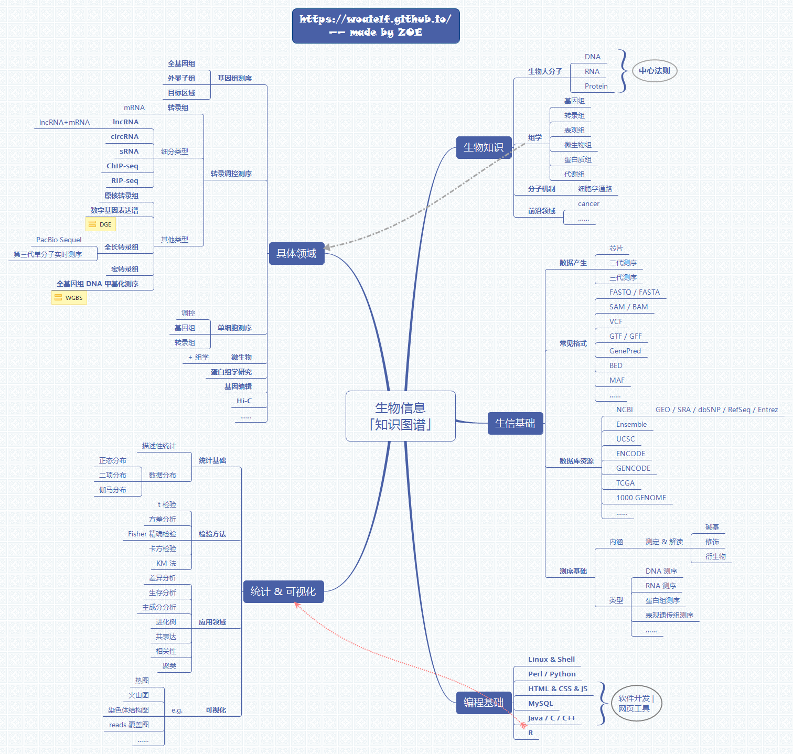
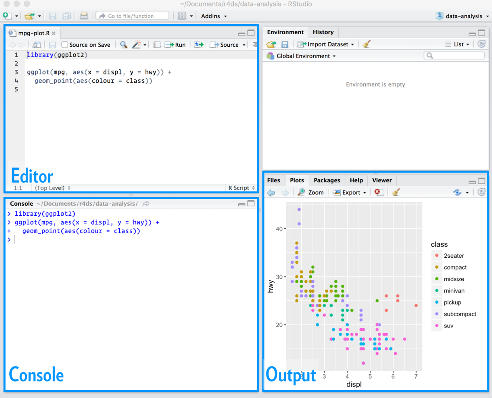

```{r setup, include=FALSE}
knitr::opts_chunk$set(collapse = TRUE,comment = "#>")

options(kableExtra.latex.load_packages = FALSE)
library(kableExtra)
library(magrittr)
knitr::opts_chunk$set(echo = FALSE, message=FALSE, warning=FALSE, out.width = '100%')

xfun::session_info('DT')
library(flexdashboard)
library(tidyverse)
library(ggplot2)
library(data.table)
```


Index
=====================================

Inputs {.sidebar}
-------------------------------------
<br>

**目录**

* 引言：生信图谱
* 第一章：R语言
* 第二章：Linux基础
* 第三章：生信常用软件及数据格式
* 第四章：Github介绍
* 第五章：生信流程介绍

Column {.tabset} 
-------------------------------------

### 引言
```{r, eval = T, echo = F,  size="small", fig.align = 'right', fig.height = 15, fig.width = 14, out.width="100%", cache=FALSE,warning=FALSE}


```

第一章
=====================================

Inputs {.sidebar}
-------------------------------------
<br>

**第一章 R语言**

* 学会使用tidyverse包
* 掌握tibble数据格式
* 学会数据导入/输出
* 数据基本操作
* ggplot2画图
* Rmarkdown
<br>

Column {.tabset} 
-------------------------------------

### 1. Rstudio平台

<br>

#### 1.1 书籍推荐

* [**R for data science**](http://www.allitebooks.org/r-for-data-science-2/)
* [**Github**](https://github.com/hadley/r4ds)

<br>

#### 1.2 R语言安装

* 安装方法参考[网页链接](https://zhuanlan.zhihu.com/p/31161726)
* Windows/Mac : [官网下载](https://mirrors.tuna.tsinghua.edu.cn/CRAN/)

<br>

#### 1.3 Rstudio安装

* Windows/Mac: [官网下载](https://www.rstudio.com/products/rstudio/download/#download)
* Rstudio工作界面
```{r, eval = T, echo = F,  size="small", fig.align = 'center', fig.height = 3, fig.width = 3, out.width="50%", cache=FALSE,warning=FALSE}


```
<br>

#### 1.4 R常用包安装/加载

* 画图：ggplot2
```{r, eval = F, echo = T}
# 安装包，此处引号不可省略
install.packages("ggplot2")

# 加载
library(ggplot2)

# 了解用法
?ggplot
```
<br>

* tibble数据格式: tidyverse 
```{r, eval = F, echo = T}
# 安装包
install.packages("tidyverse")

# 加载
library(tidyverse)

# 了解用法
?tidyverse
```
<br>

* 判断安装/加载
```{r, eval = F, echo = T}
# 判断包是否安装，如未安装刚先安装再加载
if(!require(tidyverse))install.packages("tidyverse")
library(tidyverse)
```
<br>

### 2. tidyverse

#### 2.0 网上资源
* [初学者学习tidyverse](https://www.jianshu.com/p/f3c21a5ad10a)
* [数据清洗转换](https://blog.csdn.net/ss_fisher/article/details/80919026)
* [tidyverse基础知识汇总](https://www.cnblogs.com/YangCool/p/9944217.html)
<br>

#### 2.1 数据导入
```{r, eval = T, echo = T}
# 加载所需包和表达量数据
library(tidyverse)   
fpkm <- read_tsv("data/fpkm.txt", col_names = T)  # 默认有表头，csv文件可用read_csv来加载
fpkm  
```
注：注意观察第一行所显示数据格式 tibble

<br>

#### 2.2 文件输出
```{r, eval = F, echo = T}
# 文件写出
write_tsv(fpkm, "data/fpkm_v2.txt", col_names = T)  # txt文件输出
write_csv(fpkm, "data/fpkm_v2.csv", col_names = T)  # csv文件输出
```
<br>

#### 2.3 空值处理
```{r, eval = F, echo = T}
# 将LF列空值删除
fpkm %>% filter(!is.na(LF))

# 注意此处用到了几个语法：
# 1. %>%为管道符，即下一步；
# 2. is.na()用来判断是否为空值，!is.na()当然为非空, !is.na(LF)为判断LF列非空；
# 3. filter()为按条件过滤，满足条件地留下，不满足条件的删除；
# 4. 管道符的使用不会更改初始fpkm的变量
# 5. fpkm_filter <- fpkm %>% filter(!is.na(LF)) 可将结果导入新变量，R推荐"<-" 替代等号；

# 空值赋值为0
fpkm[is.na(fpkm)] <- 0   # fpkm中的NA值已被替换为0
fpkm   
```
<br>

#### 2.4 画柱状图
```{r, eval = T, echo = T, fig.align = 'center', fig.height = 6, fig.width = 10, out.width="50%", fig.showtext = T, cache=FALSE, fig.cap="Fig. GR柱状图", warning=FALSE}
#library(ggplot2)  

fpkm[is.na(fpkm)] <- 0 # 空值替换为0
dat <- fpkm %>% gather(`AM`, `AF`, `LM`, `LF`, key = "Group", value = "FPKM") %>%
  mutate(Name = paste0(Species, "_", Group)) %>% filter(str_detect(Gene, "GR"))
  
# 注意此处用到了几个语法：
# 1. %>% 管道符；
# 2. gather() 将AM AF LM LF四列数据合并为两列，即Group和FPKM；
# 3. mutate() 增加新变量；
# 4. paste0 将两个变量连起来；
# 5. filter() 条件过滤；

ggplot(data = dat, mapping = aes(x = Gene, y = log10(FPKM + 1), fill = Name)) +
  geom_bar(stat="identity") + labs(x="") +
  theme(axis.text.x=element_text(size = 10, angle= -45, hjust = -0.001, vjust = 1)) 

```
<br>

#### 2.5 画OBP热图
```{r, eval = T, echo = T, fig.align = 'center', fig.height = 6, fig.width = 4, out.width="40%", fig.showtext = T, cache=FALSE, fig.cap="Fig. OBP热图", warning=FALSE}
library(pheatmap)
 
union <- fpkm %>% mutate(Gene_name = paste0(Species, Gene)) %>% 
  filter(str_detect(Gene, "OBP")) %>%
  select(Gene_name, AM, AF, LM, LF)

# 注意此处用到了几个语法：
# 1. %>% 管道符；
# 2. mutate() 增加新变量；
# 3. paste0 将两个变量连起来；
# 4. filter() 条件过滤；
# 5. str_detect 字符匹配，能够从Gene中匹配到OBP为TRUE， filter()会保留TRUE的行；
# 6. select() 选择想要保留的列；

union <- as.data.frame(union)  # tibble转换为data.frame格式
rownames(union) <- union[,1]     # 设置首列为行名称
union <- union[,-1]              # 只保留4列数据
union <- log10(union + 1)        # 表达量数据差异大，应取log值 

# 画图
pheatmap(union, color=colorRampPalette(rev(c("red", "linen")))(10), 
         legend = T, show_rownames = TRUE, 
         fontsize_row = 4, cellwidth = 55, 
         cluster_rows = F, cluster_cols = F, border_color = NA)

```

<br>

#### 2.6 物种BmorOBP热图
```{r, eval = T, echo = T, fig.align = 'center', fig.height = 6, fig.width = 4, out.width="40%", fig.showtext = T, cache=FALSE, fig.cap="Fig. BmorOBP热图", warning=FALSE}
library(pheatmap)
fpkm[is.na(fpkm)] <- 0    # 空值替换为0
union <- fpkm %>% mutate(Gene_name = paste0(Species, Gene)) %>% 
  filter(str_detect(Gene, "OBP") & Species == "Bmor") %>% 
  select(Gene_name, AM, AF, LM, LF)

# 注意此处用到了几个语法：
# 1. filter() 增加2个条件同时满足；

union <- as.data.frame(union)  # tibble转换为data.frame格式
rownames(union)<-union[,1]     # 设置首列为行名称
union<-union[,-1]              # 只保留4列数据
union<-log10(union + 1)        # 表达量数据差异大，应取log值 

# 画图
 pheatmap(union, color=colorRampPalette(rev(c("red", "linen")))(10), 
          legend=T, show_rownames = TRUE, 
          fontsize_row = 4, cellwidth = 55, 
         cluster_rows = F, cluster_cols = F, border_color = NA)

```

### 3. tibble

<br>

#### 3.1 了解tibble数据格式
```{r, eval = T, echo = T}
# R中传统的data.frame是很老的数据结构，而在新的tidyverse框架中提出了新的tibble来替代;

# 查看tidyverse内置数据mpg
mpg  
```
<br>

#### 3.2 ggplot画个图
* [ggplot画图](https://www.jianshu.com/p/9c1065904d53)
* [ggplot分面画囷](https://blog.csdn.net/u014801157/article/details/24372507)

```{r, eval = T, echo = T, fig.align = 'center', fig.height = 6, fig.width = 10, out.width="60%", fig.showtext = T, cache=FALSE, fig.cap="", warning=FALSE}
# 散点图
ggplot(data = mpg) + 
  geom_point(mapping = aes(x = displ, y = hwy, color = class))
# 分面作图使用 facet_wrap()
ggplot(data = mpg) + 
  geom_point(mapping = aes(x = displ, y = hwy)) + 
  facet_wrap(~ class, nrow = 2)
# 柱状图
ggplot(data = diamonds) + 
  geom_bar(mapping = aes(x = cut, fill = cut))
# 箱形图
ggplot(data = mpg, mapping = aes(x = class, y = hwy)) + 
  geom_boxplot()
# 箱形图(x y轴互换)
ggplot(data = mpg, mapping = aes(x = class, y = hwy)) + 
  geom_boxplot() + coord_flip()

```
<br>

#### 3.3 tibble基本操作
* 过滤 filter()
```{r, eval = T, echo = T}
# 使用内置数据 flights
library(nycflights13)
flights
# 过滤 filter()
flights %>% filter(month == 1, day == 1)
# 单变量多条件过滤
flights %>% filter( month %in% c(11, 12)) 
# 更多精彩内容详见 R for data science 一书！！！ 

```
<br>

* 数据选择 select()
```{r, eval = T, echo = T}
flights_select <- flights %>% select(year:day, ends_with("delay"), distance, air_time)

# 从 flights中选择 从year到day列，以delay结尾的列，及distance、air_time列
# 并将所选内容赋值新变量 flights_select

flights_select
```
<br>

* 增加新变量 mutate()
```{r, eval = T, echo = T}
flights_select %>% mutate(
  gain = arr_delay - dep_delay, 
  speed = distance / air_time * 60)
# 只保留新变量使用 transmute()
flights_select %>% transmute(
  gain = arr_delay - dep_delay, 
  speed = distance / air_time * 60)
```
<br>

* 统计 summarize()， 和分组 group_by()联用
```{r, eval = T, echo = T}
flights %>% group_by( year, month, day) %>% 
  summarize(mean = mean(dep_delay, na.rm = TRUE))
# 更多精彩内容详见 R for data science 一书！！！
```
<br>


第二章
===================================

Inputs {.sidebar}
-------------------------------------
<br>

**第二章 Linux基础**

* 掌握基础linux命令
* sed/awk/vim工具进阶
* 编写shell脚本

<br>

Column {.tabset} 
-------------------------------------

### 1. linux基础

<br>

#### 1.0 网络资源
* [Linux入门学习](https://blog.csdn.net/zhanglijingCSDN/article/details/82494312)
* [Linux新手入门教程](https://blog.csdn.net/zhanglijingCSDN/article/details/82494312)

<br>

#### 1.1 必掌握基础
```{r}
command_list <- "
Command; Notes; 用法
cd     ;切换工作路径 ; cd 目录名称
mkdir  ;新建工作目录 ; mkdir [参数] 目录名称
less   ;查看文件     ; less file
head   ;显示前10行   ; head [参数] file
tail   ;显示末尾10行 ; tail [参数] file
wc     ;统计         ; wc [参数] file
grep   ;提取         ; grep [参数] file
pwd    ;当前工作目录 ; pwd
top    ;动态监视进程 ; top
kill   ;杀死进程     ; kill[参数] [进程PID]
wget   ;下载         ; wget [参数] 下载地址
...    ;...          ;...
" 
command_dat <- read.delim(text = command_list, stringsAsFactors = FALSE,header = TRUE, sep = ";",
                 check.names = FALSE) 
knitr::kable(command_dat, booktabs = TRUE, longtable = FALSE, escape = TRUE, align = 'c', linesep = '\\addlinespace', booktabs = TRUE) %>%
    kable_styling(full_width = T, latex_options = c("hold_position")) %>% 
    add_header_above(c("表. Linux必掌握基础命令" = 3), bold = T)

```


### 2. linux进阶

<br>

#### 2.1 sed
```{bash, eval = T, echo = T} 
# 计数统计
wc -l /Users/liang/Desktop/github/Bioinformatics_learn/data/fpkm.csv
```

```{bash, eval = T, echo = T} 
# 将OBP替换为obp
path=
less /Users/liang/Desktop/github/Bioinformatics_learn/data/fpkm.csv | grep 'OBP'| \
  sed 's/OBP/obp/'| head 

# 注意此处用到的语句：
# 1. less 查看文件
# 2. | 为linux中的管道符，使用频率非常高
# 3. grep 为提取能够匹配的行
# 4. sed 替换
# 5. head 只显示前十行；对应的tail只显示末尾10行

```


#### 2.2 awk

#### 2.3 vim

### 3. shell脚本

#### 3.1


About
====================================

Inputs {.sidebar}
-------------------------------------


Column 
-------------------------------------

### **欢迎入坑**
<br>

* 生信命令不需要背，但需掌握常用的一些命令；
* 遇到问题一定要百度、谷歌、必应搜索，你遇到的问题或许别人已经给出解决方案；
* 学以致用效率最高，建议从 [**R for data science**](http://www.allitebooks.org/r-for-data-science-2/) 入手，掌握一些基础数据分析、画图能力；
* 循序渐进，逐步入门，共同进步~
<br>

### **说明**

<br>

* 生信入门三年，学点儿皮毛，整理不完善之处请谅解；
* 所谓生信培训班太基础，收费还贵（PS：看不下去~）；
* 简单整理这几年入门趟的坑儿，希望能够入门效率高些；
* 整理基础知识，也是对自己知识的沉淀，得空余时间整理，速度偏慢；
* ...
<br>

### **生信履历**

<br>
```
  2014.08 - 2015.12 : 植保所昆功组 - 转录组   - 生信入门 + 自学；
  2015.12 - 2017.05 : 诺禾致源     - 基因组   - perl/R/bash；
  2017.06 - 2018.12 : 量化健康     - 宏基因组 - perl/R/bash/python/docker/git/ML;
  2018.12 - 至今    : 先声诊断     - Nanopore - 数据库/机器学习 + 成长中~；
  
```
<br>


